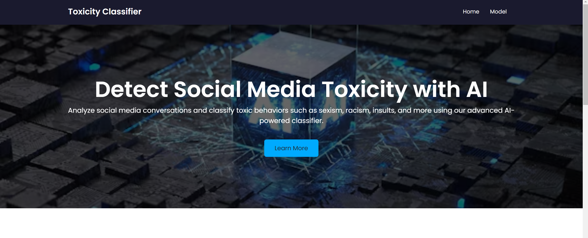
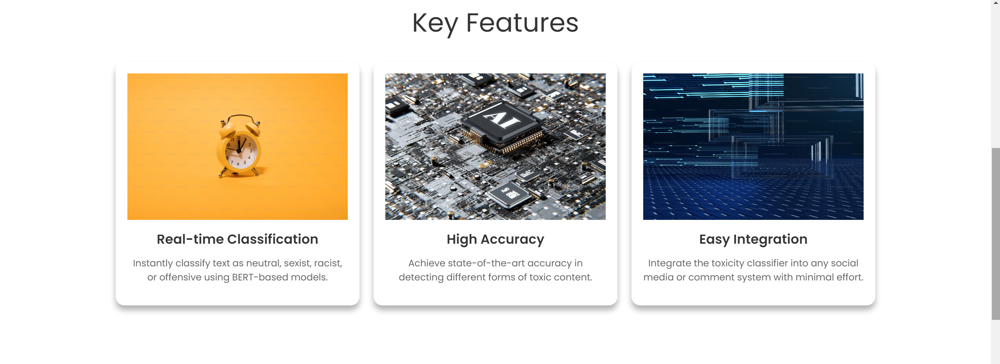
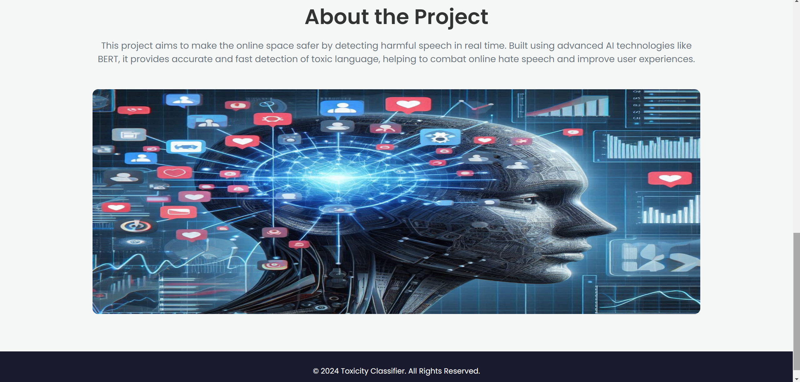
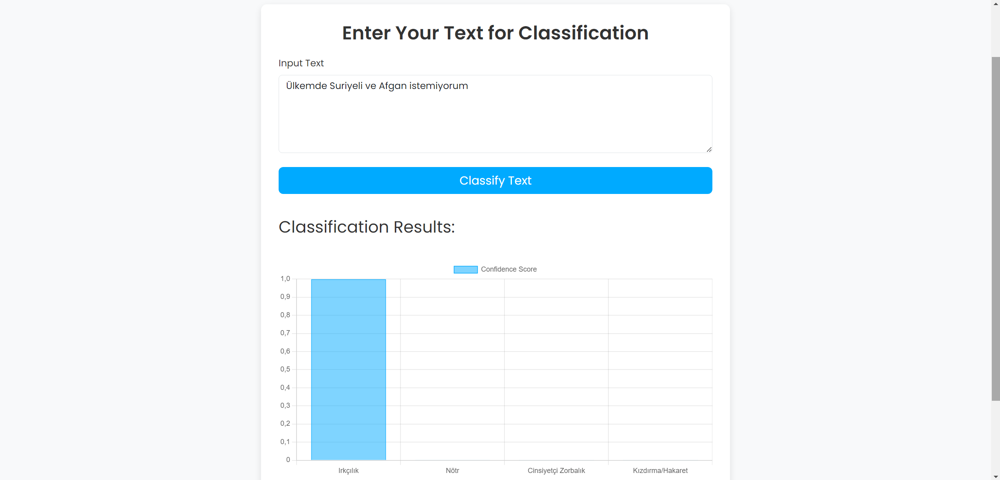
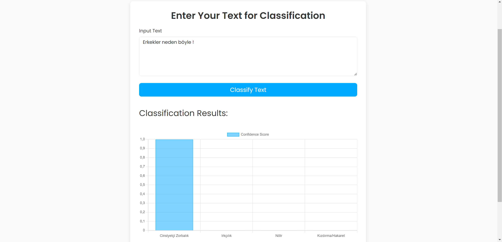

# 🌐 Turkish Bullying Classification Project using Hugging Face Model & Django


## 🎯 Project Overview

This project integrates Hugging Face's [Nane Limon bert-base-turkish-bullying model](https://huggingface.co/nanelimon/bert-base-turkish-bullying) into a Django framework to classify Turkish text comments into four 
categories:


- **Insult** 🗣️
- **Neutral** 😐
- **Racism** 🏴
- **Sexism** 🚫

The aim is to create a user-friendly web interface that identifies and categorizes offensive or harmful content in Turkish, promoting healthier online conversations.

## ✨ Features

- **Homepage with Modern UI** 🎨  
  A visually appealing, animated homepage built with JavaScript, showcasing the project's goals and functionality. The design is modern, responsive, and user-friendly.

- **Comment Classification Page** 📝  
  Users can submit their comments to be analyzed using the Hugging Face model. The system classifies the comments into predefined categories: **Insult**, **Neutral**, **Racism**, or **Sexism**. The results are displayed in a dynamic bar chart, providing users with a clear understanding of the model’s classification.

- **Real-Time Feedback** 📊  
  The classification results are visualized with a dynamic bar created with JavaScript, offering an interactive experience for the users.

## 🛠️ Technologies Used

- **Django Framework** 🐍  
  A robust backend structure that enables seamless integration between the frontend and the Hugging Face model.

- **Hugging Face Model** 🤗  
  The **Nane Limon bert-base-turkish-bullying** model is used for text classification. It is specifically fine-tuned to detect offensive language in Turkish.

- **JavaScript** ⚡  
  Used to create interactive animations and the dynamic bar chart that displays the classification results in real time.

- **HTML5 & CSS3** 🎨  
  For building responsive and aesthetically pleasing web pages.

## 📷 Project Screenshots

### Homepage

<br>

<br>


### Classification Page

<br>


## 🚀 Purpose & Benefits

- **Purpose**:  
 Utilizing the transformer model to automatically detect harmful or offensive content in Turkish, making online platforms safer and more inclusive.

- **Benefits**:  
  - **Efficient Moderation**: Automate the content moderation process by quickly identifying toxic comments.
  - **Improved User Experience**: Provide a safer space for users by limiting exposure to harmful language.
  - **Awareness**: Raise awareness about the impact of language online and encourage respectful communication.

## 📦 Setup & Installation

1. Clone the repository:
    ```bash
    git clone https://github.com/HasanCan6241/toxicity_classifier.git
    ```
2. Navigate to the project directory:
    ```bash
    cd toxicity_classifier
    ```
3. Install the required dependencies:
    ```bash
    pip install -r requirements.txt
    ```
4. Run the Django server:
    ```bash
    python manage.py runserver
    ```

## 📊 Usage

1. Access the homepage to learn more about the project and its objectives.
2. On the **Model** page, enter a comment you want to analyze.
3. Submit the comment and view the classification result in real-time through the interactive bar chart.

## 🎯 Future Enhancements

- **Additional Categories**: Expand the model to include more nuanced categories of offensive language.
- **Improved Accuracy**: Regularly fine-tune the model with more data to improve the accuracy of classifications.
- **Language Support**: Introduce multilingual support for other languages beyond Turkish.

